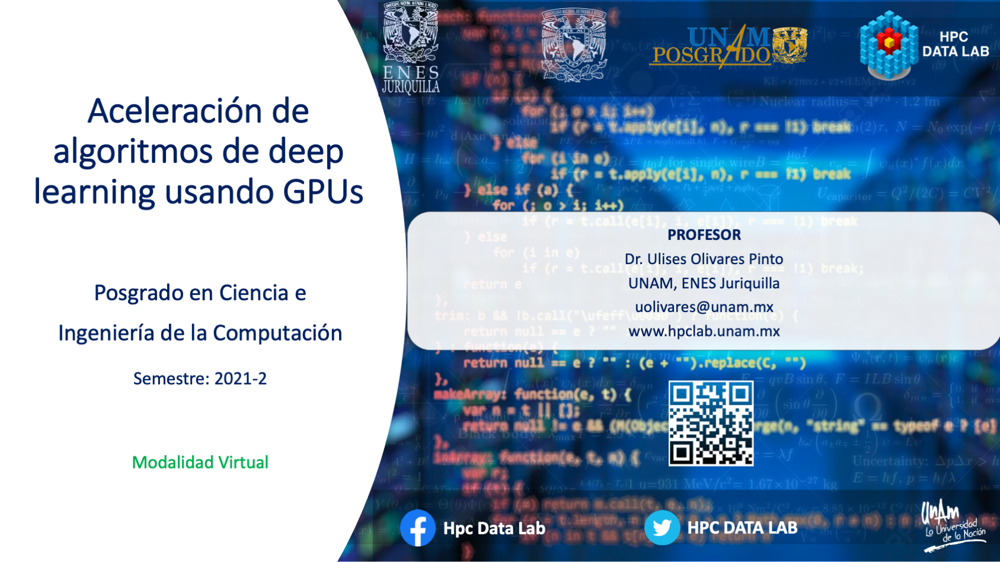

# Posgrado en Ciencia e Ingeniería de la Computación 

###  Semestre: 2021-II

## Profesores
 Dr. Ulises Olivares Pinto
 
 Dr. David Oswaldo Pérez Martínez

## Objetivo del curso
Presentar al estudiante el modelo de programación paralela empleando Unidades de
Procesamiento Gráfico (GPUs). Se utilizarán los GPUs como dispositivo de propósito
general para la resolución de problemas inherentemente paralelos con aplicaciones en el área de aprendizaje profundo.

## Prerequisitos
#### Deseables
+ Dominio de los lenguajes de programación C y C++ 
+ Conicimiento básico de estructuras de datos y algoritmos

#### Hardware
Se deberá contar con una computadora con GPU de la marca NVIDIA

#### Software
Se deberá contar con el siguiente software instalado 

  + [CUDA Toolkit] (https://developer.nvidia.com/cuda-toolkit)
  + Entonrno de desarrollo integrado(IDE)
    - Eclipse
    - Clion
  + [NVIDIA NSIGHT](https://developer.nvidia.com/nsight-visual-studio-edition)
    

#### Cuentas
Se deberán crear cuentas en las siguientes plataformas:
  + Crear una cuenta en GitHub
  + Google Classroom
  
## Contenido del curso
| No.        | Tema           | Conceptos |Código  |  Material complementario|
| :-------------: |:-------------| :-------------|:-----:| :-----|
| 1.              |Introducción a la programación con GPUs          | Introducción a CUDA, modelo de programación paralelo, consulta de dispositivo |   <ol><li>[Hello World](code/1.hello.cu)</li> <li>[vectorAdd](code/2.vectorAdd.cu)</li> <li>[CUDA Samples](https://github.com/NVIDIA/cuda-samples)</li></ol>    |  Capítulo 1 - (D.Kirk et al., 2017)
| 2.              |Organización de bloque e Hilos     | Bloques,  hilos, indexación y rendimiento |   <ol><li>[vectorAdd](code/2.vectorAdd.cu)</li></ol>    |  Capítulos 2 y 3 - (D.Kirk et al., 2017)
| 3.              |Organización de hilos y jerarquía de memoria  | Localidad de datos, memoria compartida, local y global |   <ol><li>[Importar Imágenes](code/importImage)</li></ol>    |  Capítulos 4 y 5 - (D.Kirk et al., 2017)

**Última actualización: 5 de marzo de 2021**
